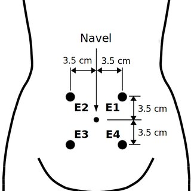

# Electrohysterogram (EHG) Contraction Detection using RMS + PE

> Advanced signal processing techniques on EHG (Electrohysterograms) signals with two states pre-term and term for contraction detection techniques.

  
  

